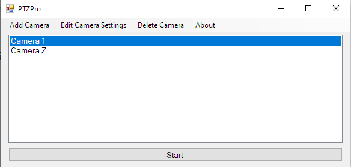
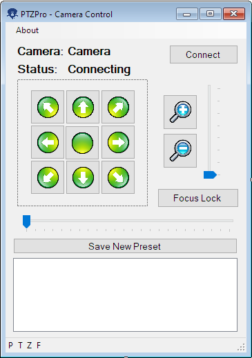

# **PTZPro**
I made this program for controlling VISCA TCP PTZ cameras.
## **Screenshots**
### Camera selection menu

### Camera control screen

## **Problems?**
Open an [issue](https://github.com/jairbj/PTZPro/issues)
## **Todo**
- [ ] Help menu
- [ ] Focus lock function
- [ ] Integration with Vmix for showing when the camera is active
## **Credits**
### Icons:
https://iconarchive.com/artist/hopstarter.html